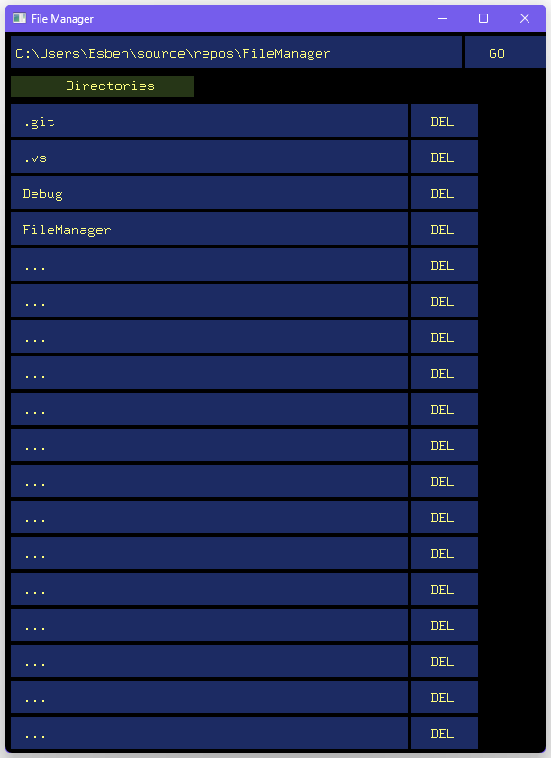

# File Manager | OpenGL & FreeGlut | C++ / CLR support
This was an exam project made for a programming class at C level in 2013/2014. It scored the highest grade.  
It utilizes the Common Language Runtime (CLR) for filesystem handling, and rendering is done using OpenGL and freeglut.

It features: 
- Directory navigation
- File and directory deletion
- File copy

  
   

